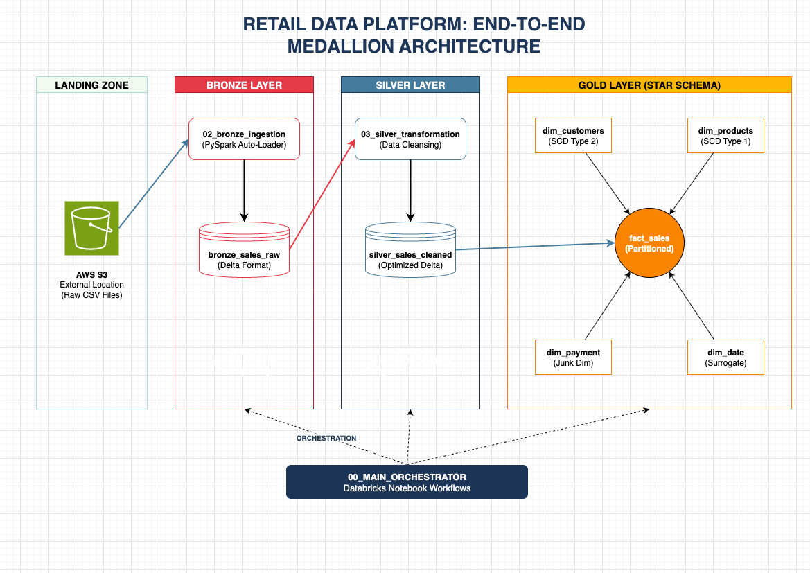

# End-to-End Retail Data Engineering Platform
### Medallion Architecture | Databricks | Delta Lake | AWS S3 | PySpark

## Project Overview
This project implements a production-grade **Medallion Architecture** to process and analyze large-scale retail transaction data (**5.9M+ records**). The platform transforms raw, unstructured data into a high-performance **Star Schema**, solving key challenges in data quality, PII security, and historical tracking.

## Business Context & Problem Statement
In a high-volume retail environment, data arrives from disparate sources with inconsistent naming (e.g., "Headphonz" vs "Headphones"), duplicate entries from system retries, and unmasked sensitive customer info.
- **Data Source:** Synthetic Enterprise Retail Dataset (5.9M+ rows) designed to simulate real-world data quality issues and high-velocity ingestion.
- **The Goal:** Build an automated, idempotent pipeline that provides a "Single Version of Truth" for executive revenue reporting while maintaining full historical context of customer movements.

## Architecture & Design
The pipeline is divided into three layers to ensure data reliability and governance:

- **Bronze (Raw):** Ingestion from **AWS S3 External Locations** into Delta tables using schema-on-read.
- **Silver (Cleansed):** - Data deduplication using a unique `row_hash` generated from business keys.
    - PII masking of `cust_id` using **SHA-256** encryption.
    - Standardizing product catalogs and enforcing data quality gates (null checks, price validation).
- **Gold (Curated):** A business-ready Star Schema featuring:
  - **SCD Type 2** (Slowly Changing Dimensions) to track customer geography history.
  - **Junk Dimensions** for transactional metadata.
  - **Surrogate Keys** for high-performance join optimization.

## Cloud Infrastructure & Tech Stack
- **Cloud Storage:** AWS S3 (Data Lake)
- **Governance:** Unity Catalog (External Locations & Storage Credentials)
- **Compute:** Databricks Serverless Runtime
- **Language:** PySpark (Spark SQL & DataFrames)
- **Table Format:** Delta Lake (ACID Transactions, Time Travel, Schema Evolution)
- **Orchestration:** Databricks Notebook Workflows Orchestrator

## Repository Structure
- `00_Main_Orchestrator`: Master controller managing sequential and parallel execution.
- `01_setup_notebook`: Infrastructure configuration and database mounting.
- `02_bronze_sales_ingestion`: Ingestion logic from landing zone to Delta.
- `03_silver_sales_transformation`: Cleaning, hashing, and PII masking.
- `04_sales_data_profiling`: Statistical analysis of cleansed data quality.
- `05-08_gold_dimensions`: Dimension modeling (SCD1, SCD2, and Junk Dims).
- `09_gold_fact_sales`: Centralized fact table with partitioned storage (Year/Month).
- `10_project_validation_dashboard`: End-to-end data integrity and KPI verification.

## Sample Analytics Output
The Gold layer enables millisecond-latency queries for complex business questions. Below is a sample of **Top Revenue by Region and Product**:

| Region | City | Category | Product | Total Revenue (INR) | Total Orders |
| :--- | :--- | :--- | :--- | :--- | :--- |
| South | Bangalore | Electronics | Smart phones | 3,080,010,923.56 | 54,447 |
| South | Bangalore | Electronics | Smart Watch | 3,070,265,590.98 | 54,237 |
| South | Bangalore | Electronics | Laptop | 3,037,502,527.10 | 53,801 |

## Key Engineering Results
- **Data Parity:** Maintained 100% integrity across **5,957,141** records from Bronze to Gold.
- **Idempotency & Resilience:** Designed a self-healing pipeline using Delta `MERGE` and `row_hash` that can be re-run indefinitely without data duplication.
- **Data Governance:** Implemented **Unity Catalog** for centralized metadata management and secure S3 access via External Locations.
- **Schema Evolution:** Leveraged Delta Lake's schema enforcement and evolution to handle upstream source changes without pipeline failure.
- **Performance:** Optimized Fact-to-Dimension joins using integer-based surrogate keys, minimizing memory shuffle during large-scale aggregations.

---
**Author:** Neel Munjpara